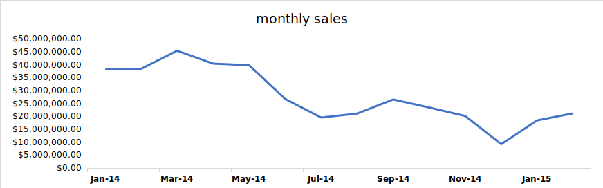
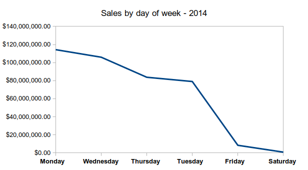
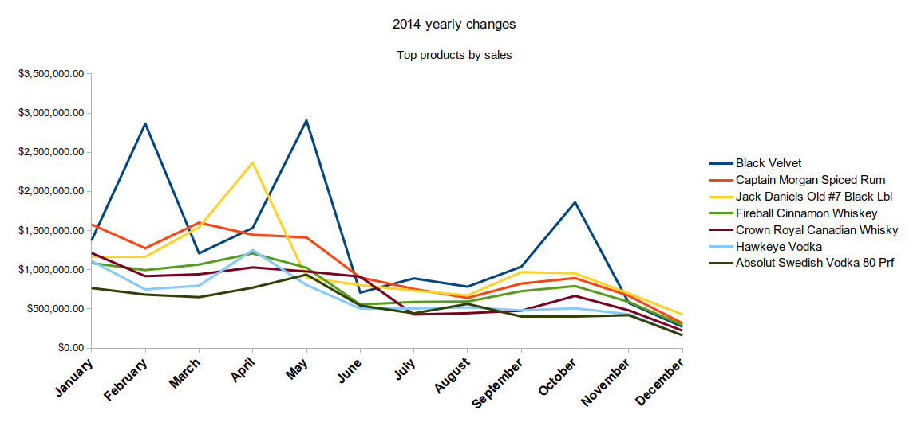
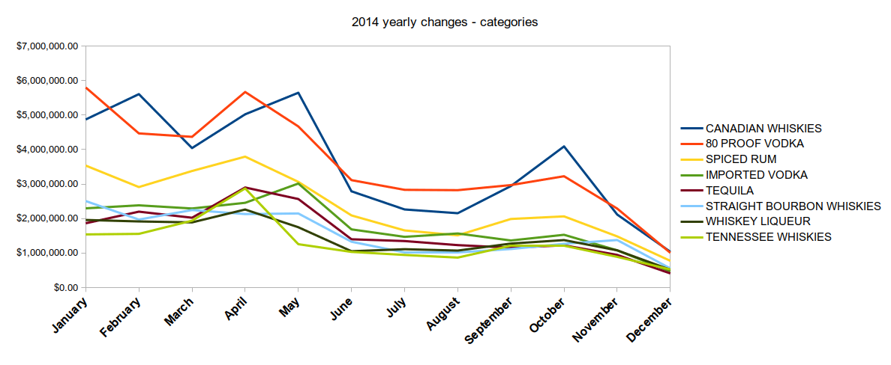
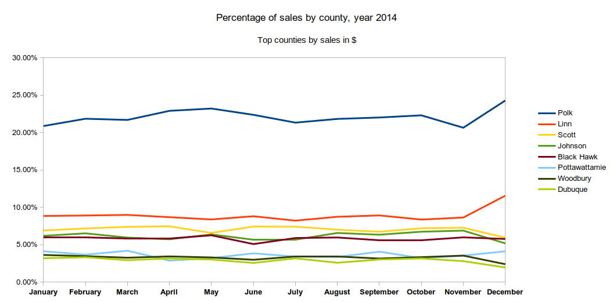

# Data analysis with SQL query

<details>
<summary>Table of contents</summary>

  * [Technologies used](#technologies-used)
  * [Summary and dataset](#summary-and-dataset)
  * [Findings](#findings)
    + [Counties](#counties)
      - [Per capita spending – counties with 100k+ population](#per-capita-spending-%E2%80%93-counties-with-100k-population)
      - [Sales by stores – counties with 100k+ population](#sales-by-stores-%E2%80%93-counties-with-100k-population)
    + [Stores](#stores)
    + [Products](#products)
        * [Total sales: $392,293,023](#total-sales-392293023)
    + [Margins](#margins)
    + [Timeframe](#timeframe)
        * [Daily trend](#daily-trend)
        * [No data on Sundays:](#no-data-on-sundays)
      - [Yearly change / growth](#yearly-change--growth)
  * [Analysis](#analysis)
    + [Counties:](#counties)
    + [Stores:](#stores)
    + [Products:](#products)
    + [Yearly changes:](#yearly-changes)
</details>

### Technologies used
PostgreSQL, pgAdmin

## Summary and dataset

The following is an analysis of liquor sales in the US state of Iowa. The data is publicly available on the [state's website](https://data.iowa.gov/Sales-Distribution/Iowa-Liquor-Sales/m3tr-qhgy) and has 24 columns such as price, quantity, store name, tracking each individual sale of liquor.

I had access to a remote PostgreSQL database hosting this data, which covered sales made from January 2 2014 to February 26 2015. The database is divided into 4 main tables :

> Products | Sales | Stores | Counties 

<details>
<summary>Columns inside each table</summary>

| Products         | sales             | stores        | counties   |
|------------------|-------------------|---------------|------------|
| item_no          | date              | store         | county     |
| category_name    | convenience_store | name          | population |
| item_description | store             | store_status  |            |
| vendor           | county_number     | store_address |            |
| vendor_name      | county            | address_info  |            |
| bottle_size      | category          |               |            |
| pack             | category_name     |               |            |
| inner_pack       | vendor_no         |               |            |
| age              | vendor            |               |            |
| proof            | item              |               |            |
| list_date        | description       |               |            |
| upc              | pack              |               |            |
| scc              | liter_size        |               |            |
| bottle_price     | state_btl_cost    |               |            |
| shelf_price      | btl_price         |               |            |
| case_cost        | bottle_qty        |               |            |
|                  | total             |               |            |
</details>

All those tables had at least one column in common with another which allowed me to link them when needed. 
    
## Findings

### Counties
    
#### Per capita spending – counties with 100k+ population


<details>
<summary>SQL query</summary>

```SQL 
-- per capita spending, only counties with 100k+ pop
select a.county,b.population, count(distinct store) as num_stores,sum(total)::money as total_sales, cast(sum(a.total) / b.population as money) as total_per_capita from sales a
inner join counties b using(county) 
where b.population >= 100000
group by  a.county, b.population order by 2 desc limit 100
```
</details>

| **County** | **Population** | **nr\_of\_stores** | **total\_sales** | **sales\_per\_capita** |
| ---------- | -------------- | ------------------ | ---------------- | ---------------------- |
| Polk       | 430640         | 197                | $86,397,461.79   | $200.63                |
| Linn       | 211226         | 102                | $34,460,047.49   | $163.14                |
| Scott      | 165224         | 64                 | $27,902,848.67   | $168.88                |
| Black Hawk | 131090         | 78                 | $22,967,283.29   | $175.20                |
| Johnson    | 130882         | 49                 | $24,200,402.25   | $184.90                |
| Woodbury   | 102172         | 40                 | $13,242,016.16   | $129.61                |

**Linn county**, while being the second most populated county, has similar sales figures as smaller counties will fewer stores.


####  Sales by stores – counties with 100k+ population

<details>
<summary>SQL query</summary>

```SQL 
-- per store spending,  only counties with 100k+ pop:
select a.county,b.population, count(distinct store) as num_stores,sum(total)::money as total_sales, cast(sum(a.total) / count(distinct store) as money) as total_per_store from sales a
inner join counties b using(county) 
where b.population >= 100000
group by  a.county, b.population order by 2 desc limit 100
```
</details>

| **County** | **Population** | **nr\_of\_stores** | **total\_sales** | **sales\_per\_store** |
| ---------- | -------------- | ------------------ | ---------------- | --------------------- |
| Polk       | 430640         | 197                | $86,397,461.79   | $438,565.80           |
| Linn       | 211226         | 102                | $34,460,047.49   | $337,843.60           |
| Scott      | 165224         | 64                 | $27,902,848.67   | $435,982.01           |
| Black Hawk | 131090         | 78                 | $22,967,283.29   | $294,452.35           |
| Johnson    | 130882         | 49                 | $24,200,402.25   | $493,885.76           |
| Woodbury   | 102172         | 40                 | $13,242,016.16   | $331,050.40           |

**Linn**, **Black Haw** and **Woodbury** counties have fewer sales per store compared to the other counties of similar sizes.

### Stores

<details>
<summary>SQL query</summary>

```SQL 
 -- How many stores: 1973 stores, 1425 active stores, 548 inactive
select count(*) from stores where store_status ilike 'a'
-- County with most active stores: Polk with 194 active stores, Linn 98 stores Dickinson only 15 stores
select b.county, count(distinct c.store) as stores_in_county from sales a left join counties b using(county) left join stores c using(store)
where c.store_status ilike 'A' group by b.county order by 2 desc
-- Stores with most sales total : Hy-vee #3 / Bdi / Des Moines : $13,920,087.22
select b.name,  cast(sum(a.total)as money) as total_sales from sales a left join stores b using(store) 
group by b.name order by 2 desc
-- details
select * from sales inner join stores using(store) where stores.name ilike 'Hy-vee #3%' order by total desc limit 200
-- Stores with highest average sale: Paradise Distilling Company $7,578.15 ONLY 6 SALES
select b.name, a.county,a.convenience_store,  avg(total)::money  as avg_total from sales a left join stores b using(store) 
group by b.name, a.county, a.convenience_store order by 4 desc limit 100

-- stores with at least one sale of 500+ bottles
select b.name, a.county, max(a.bottle_qty) as max_bottles_sold, avg(bottle_qty)::integer as avg_bottles_sold, avg(total)::money as avg_total 
from sales a inner join stores b using(store) 
group by b.name, a.county having max(a.bottle_qty) > 500 order by 4 desc limit 200

-- percentage of sales 100+ bottles these stores have made? Only stores with at least 500 sales
select sel_2.store, name, county, count(sel_2.store) as nr_sales, sel1_total::money as total_sales, 
 sel1_avg::money as avg_sales, (avg(over_x))::numeric as percent_over_100 from
(select store, sum(total)  as sel1_total,avg(total) as sel1_avg from sales group by store order by 2 desc limit 100
) as sel_1
inner join
(select a.store, b.name, a.county, a.bottle_qty, a.total,
CASE
	when a.bottle_qty > 100 then 1
	else 0
END as over_x
from sales a inner join stores b using(store) 
group by a.store, b.name, a.county, a.bottle_qty, a.total 
order by 5 asc) as sel_2
using(store)
group by sel_2.store, name,county, total_sales, avg_sales  having count(sel_2.store) > 1000  order by 5 desc limit 100

-- stores have made 2255 sales on average
select avg(count) from (select store,count(total) from sales group by store order by 2 desc) as all_stores

```
</details>


| **Name**                            | **County** | **Nr of sales** | **Total sales** | **Avg sales** | **% of sales 100+ btl** |
| ----------------------------------- | ---------- | --------------- | --------------- | ------------- | ----------------------- |
| Hy-vee \#3 / Bdi / Des Moines       | Polk       | 2046            | $13,920,087.22  | $472.43       | 9%                      |
| Central City 2                      | Polk       | 2143            | $11,942,399.97  | $462.40       | 10%                     |
| Sam's Club 6344 / Windsor Heights   | Polk       | 1310            | $6,159,480.06   | $1,106.23     | 35%                     |
| Sam's Club 8162 / Cedar Rapids      | Linn       | 1477            | $5,734,721.57   | $803.75       | 30%                     |
| Hy-vee Wine and Spirits / Iowa City | Johnson    | 2401            | $5,665,143.70   | $235.67       | 6%                      |
| Costco Wholesale \#788              | Dallas     | 877             | $4,907,465.88   | $1,825.69     | 32%                     |
| Lot-a-spirits                       | Scott      | 1302            | $4,289,169.59   | $319.73       | 3%                      |
| Sam's Club 8238 / Davenport         | Scott      | 1021            | $3,308,625.56   | $623.56       | 24%                     |
| **Average**                         | **1572**   | **$6,990,886**  | **$731.18**     | **18.45%**    |                         |

The top 10 stores in total sales on average have 18.45% transaction
involving 100+ bottles. This indicates that sales are more consumer
oriented than
wholesale.

### Products

<details>
<summary>SQL query</summary>

```SQL 
/*** GA Project SQL - 2014 monthly growth of top products ****/

-- Item making most sales: black velvet, hawkeye vodka
select a.description, a.category_name, sum(total)::money as total_sales, total_sales_jan, total_sales_feb, total_sales_mar, total_sales_apr, total_sales_may, total_sales_jun, total_sales_jul, total_sales_aug, total_sales_sep,
total_sales_oct, total_sales_nov, total_sales_dec from sales a

join
(select description, category_name,
sum(total)::money as total_sales_jan
from sales where date between '2014-01-01' and '2014-01-31' 
group by description, category_name order by 3 desc limit 10) as jan
using (description)

join
(select description, category_name,
sum(total)::money as total_sales_feb 
from sales where date between '2014-02-01' and '2014-02-28' 
group by description, category_name order by 3 desc limit 10) as feb
using (description) 

join
(select description, category_name,
sum(total)::money as total_sales_mar
from sales where date between '2014-03-01' and '2014-03-31' 
group by description, category_name order by 3 desc limit 10) as mar
using (description) 

join
(select description, category_name,
sum(total)::money as total_sales_apr
from sales where date between '2014-04-01' and '2014-04-30' 
group by description, category_name order by 3 desc limit 10) as apr
using (description) 

join
(select description, category_name,
sum(total)::money as total_sales_may 
from sales where date between '2014-05-01' and '2014-05-31' 
group by description, category_name order by 3 desc limit 10) as may
using (description) 

join
(select description, category_name,
sum(total)::money as total_sales_jun
from sales where date between '2014-06-01' and '2014-06-30' 
group by description, category_name order by 3 desc limit 10) as jun
using (description) 

join
(select description, category_name,
sum(total)::money as total_sales_jul
from sales where date between '2014-07-01' and '2014-07-31' 
group by description, category_name order by 3 desc limit 10) as jul
using (description) 

join
(select description, category_name,
sum(total)::money as total_sales_aug
from sales where date between '2014-08-01' and '2014-08-31'
group by description, category_name order by 3 desc limit 10) as aug
using (description) 

join
(select description, category_name,
sum(total)::money as total_sales_sep 
from sales where date between '2014-09-01' and '2014-09-30' 
group by description, category_name order by 3 desc limit 10) as sep
using (description) 

join
(select description, category_name,
sum(total)::money as total_sales_oct 
from sales where date between '2014-10-01' and '2014-10-31' 
group by description, category_name order by 3 desc limit 10) as oct
using (description) 

join
(select description, category_name,
sum(total)::money as total_sales_nov
from sales where date between '2014-11-01' and '2014-11-30' 
group by description, category_name order by 3 desc limit 10) as nov
using (description) 

join
(select description, category_name,
sum(total)::money as total_sales_dec
from sales where date between '2014-12-01' and '2014-12-31' 
group by description, category_name order by 3 desc limit 10) as dece
using (description) 

group by a.description, a.category_name, 
total_sales_jan, total_sales_feb, total_sales_mar, total_sales_apr, total_sales_may, total_sales_jun, total_sales_jul, total_sales_aug, total_sales_sep,
total_sales_oct, total_sales_nov, total_sales_dec order by 3 desc limit 10
```
</details>

| **Description**                | **Category**                       | **Sales**      | **% of total sales** |
| ------------------------------ | ---------------------------------- | -------------- | -------------------- |
| Black Velvet                   | CANADIAN WHISKIES                  | $18,315,550.64 | 4.67%                |
| Captain Morgan Spiced Rum      | SPICED RUM                         | $13,772,752.25 | 3.51%                |
| Jack Daniels Old \#7 Black Lbl | TENNESSEE WHISKIES                 | $13,701,656.82 | 3.49%                |
| Fireball Cinnamon Whiskey      | WHISKEY LIQUEUR                    | $10,622,967.34 | 2.71%                |
| Crown Royal Canadian Whisky    | CANADIAN WHISKIES                  | $9,714,022.78  | 2.48%                |
| Hawkeye Vodka                  | 80 PROOF VODKA                     | $8,730,823.84  | 2.23%                |
| Absolut Swedish Vodka 80 Prf   | IMPORTED VODKA                     | $7,431,864.05  | 1.89%                |
| Grey Goose Vodka               | IMPORTED VODKA                     | $6,444,939.38  | 1.64%                |
| Jagermeister Liqueur           | MISC. IMPORTED CORDIALS & LIQUEURS | $6,298,430.40  | 1.61%                |
| Jim Beam                       | STRAIGHT BOURBON WHISKIES          | $5,163,920.19  | 1.32%                |
| **Total**                      | $100,196,927.69                    | 25.54%         |                      |

##### Total sales: $392,293,023

10 products make 25% of all sales in $

| **Item**                       | **avg btl price** | **avg sale** | **avg btl qty** | **count** |
| ------------------------------ | ----------------- | ------------ | --------------- | --------- |
| Black Velvet                   | $10.17            | $225.85      | 20.62           | 81,095    |
| Hawkeye Vodka                  | $7.31             | $117.56      | 16.06           | 74,264    |
| Seagrams 7 Crown Bl Whiskey    | $12.40            | $109.43      | 8.95            | 39,577    |
| Captain Morgan Spiced Rum      | $17.65            | $367.78      | 20.48           | 37,448    |
| Smirnoff Vodka 80 Prf          | $11.82            | $134.95      | 11.77           | 36,136    |
| Fireball Cinnamon Whiskey      | $15.58            | $294.55      | 18.47           | 36,065    |
| Jack Daniels Old \#7 Black Lbl | $25.33            | $385.22      | 15.36           | 35,568    |
| Absolut Swedish Vodka 80 Prf   | $19.28            | $224.27      | 11.02           | 33,138    |
| Bacardi Superior Rum           | $13.40            | $150.40      | 10.8            | 32,552    |
| Jim Beam                       | $16.16            | $161.85      | 9.88            | 31,906    |
| *Top 10 average*               | *$14.77*          | *$223.33*    | *14.84*         | *45,094*  |
| *All sales average*            | *$14.37*          | *$128.62*    | *9.86*          |           |

The top 10 products by unit sold all have at least 8 bottles sold per
transaction with an average of 14.84 bottles sold per transaction, which
is higher than the average of all sales. Also, of note is that the
average transaction of these products is higher by almost $100 than all
the
sales.

### Margins

<details>
<summary>SQL query</summary>

```SQL 
-- Products with the highest profit / margin by unit: 
select description, (avg((btl_price::numeric - state_btl_cost::numeric)))::money as profit_unit,
round(avg((((btl_price - state_btl_cost) / state_btl_cost) * 100)::numeric),2) as margin, 
count(description) from sales group by description order by count desc limit 20
```
</details>

| **Description**                | **Bottle price avg.** | **Bottle state cost avg** | **Total profit** | **Margin %** | **nr\_sales** |
| ------------------------------ | --------------------- | ------------------------- | ---------------- | ------------ | ------------- |
| Black Velvet                   | $10.17                | $6.75                     | $6,144,705.67    | 50.69        | 81095         |
| Captain Morgan Spiced Rum      | $17.65                | $11.77                    | $4,590,286.75    | 49.99        | 37448         |
| Jack Daniels Old \#7 Black Lbl | $25.33                | $16.88                    | $4,567,750.22    | 50.01        | 35568         |
| Fireball Cinnamon Whiskey      | $15.58                | $10.39                    | $3,541,448.72    | 50.01        | 36065         |
| Crown Royal Canadian Whisky    | $24.99                | $16.66                    | $3,237,724.15    | 50           | 28453         |
| Hawkeye Vodka                  | $7.31                 | $4.87                     | $2,913,004.84    | 50.07        | 74264         |
| Absolut Swedish Vodka 80 Prf   | $19.28                | $12.84                    | $2,482,433.43    | 50.21        | 33138         |
| Grey Goose Vodka               | $24.23                | $16.14                    | $2,149,997.33    | 50.1         | 27845         |
| Jagermeister Liqueur           | $17.81                | $11.87                    | $2,099,928.40    | 50.02        | 28714         |
| Jim Beam                       | $16.16                | $10.74                    | $1,730,013.78    | 50.44        | 31906         |

Almost all products have a margin around 50%

| **Description**                                     | **Total profit** | **Margin %** | **nr\_sales** |
| --------------------------------------------------- | ---------------- | ------------ | ------------- |
| Jim Beam Operation Homefront                        | $83,589.16       | 124.43       | 238           |
| Jose Cuervo Silver w/1L Classic Light Margarita Mix | $19,451.58       | 106.41       | 120           |
| Maestro Dobel                                       | $5,356.08        | 86.74        | 60            |
| Ole Smoky Apple Pie w/Flask                         | $1,897.92        | 78.36        | 50            |
| Passion XO Pink                                     | $324.22          | 72.83        | 24            |
| Passion XO Blue                                     | $391.30          | 70.37        | 26            |
| Jose Cuervo Gold w/1L Classic Margarita Mix         | $25,767.13       | 70.08        | 214           |
| Passion XO Sun                                      | $301.86          | 69.33        | 18            |
| Absolut Tune                                        | $3,234.32        | 58.73        | 60            |
| Skyy Infusions Texas Grapefruit                     | $836.67          | 58.52        | 19            |

The only products with a margin higher than 50% are niche products.

### Timeframe

<details>
<summary>SQL query</summary>

```SQL 
-- monthly sales
select a.description, a.category_name, sum(total)::money as total_sales, total_sales_jan, total_sales_feb, total_sales_mar, total_sales_apr, total_sales_may, total_sales_jun, total_sales_jul, total_sales_aug, total_sales_sep,
total_sales_oct, total_sales_nov, total_sales_dec from sales a

join
(select description, category_name,
sum(total)::money as total_sales_jan
from sales where date between '2014-01-01' and '2014-01-31' 
group by description, category_name order by 3 desc limit 10) as jan
using (description)

join
(select description, category_name,
sum(total)::money as total_sales_feb 
from sales where date between '2014-02-01' and '2014-02-28' 
group by description, category_name order by 3 desc limit 10) as feb
using (description) 

join
(select description, category_name,
sum(total)::money as total_sales_mar
from sales where date between '2014-03-01' and '2014-03-31' 
group by description, category_name order by 3 desc limit 10) as mar
using (description) 

join
(select description, category_name,
sum(total)::money as total_sales_apr
from sales where date between '2014-04-01' and '2014-04-30' 
group by description, category_name order by 3 desc limit 10) as apr
using (description) 

join
(select description, category_name,
sum(total)::money as total_sales_may 
from sales where date between '2014-05-01' and '2014-05-31' 
group by description, category_name order by 3 desc limit 10) as may
using (description) 

join
(select description, category_name,
sum(total)::money as total_sales_jun
from sales where date between '2014-06-01' and '2014-06-30' 
group by description, category_name order by 3 desc limit 10) as jun
using (description) 

join
(select description, category_name,
sum(total)::money as total_sales_jul
from sales where date between '2014-07-01' and '2014-07-31' 
group by description, category_name order by 3 desc limit 10) as jul
using (description) 

join
(select description, category_name,
sum(total)::money as total_sales_aug
from sales where date between '2014-08-01' and '2014-08-31'
group by description, category_name order by 3 desc limit 10) as aug
using (description) 

join
(select description, category_name,
sum(total)::money as total_sales_sep 
from sales where date between '2014-09-01' and '2014-09-30' 
group by description, category_name order by 3 desc limit 10) as sep
using (description) 

join
(select description, category_name,
sum(total)::money as total_sales_oct 
from sales where date between '2014-10-01' and '2014-10-31' 
group by description, category_name order by 3 desc limit 10) as oct
using (description) 

join
(select description, category_name,
sum(total)::money as total_sales_nov
from sales where date between '2014-11-01' and '2014-11-30' 
group by description, category_name order by 3 desc limit 10) as nov
using (description) 

join
(select description, category_name,
sum(total)::money as total_sales_dec
from sales where date between '2014-12-01' and '2014-12-31' 
group by description, category_name order by 3 desc limit 10) as dece
using (description) 

group by a.description, a.category_name, 
total_sales_jan, total_sales_feb, total_sales_mar, total_sales_apr, total_sales_may, total_sales_jun, total_sales_jul, total_sales_aug, total_sales_sep,
total_sales_oct, total_sales_nov, total_sales_dec order by 3 desc limit 10

```
</details>



Significant drop in sales from May 2014 onward.

##### Daily trend

<details>
<summary>SQL query</summary>

```SQL
-- Sales by day of the week
select sum(total)::money as total_sales, to_char(date, 'Day') as day_of_sale
from sales
group by day_of_sale
order by day_of_sale desc
```
</details>



Most sales are made at the start of the week.

##### No data on Sundays:

*Only Class E liquor licensees (carryout liquor) and Class B wine
permittees (carryout wine) have a Sunday sales privilege as part of
their basic license. *

*** Source:
[<span class="underline">https://abd.iowa.gov/alcohol/alcohol-laws/hours-sale</span>](https://abd.iowa.gov/alcohol/alcohol-laws/hours-sale)***

#### Yearly change / growth

<details>
<summary>SQL query</summary>

```SQL 
-- Item making most sales: black velvet, hawkeye vodka
select a.description, a.category_name, sum(total)::money as total_sales, total_sales_jan, total_sales_feb, total_sales_mar, total_sales_apr, total_sales_may, total_sales_jun, total_sales_jul, total_sales_aug, total_sales_sep,
total_sales_oct, total_sales_nov, total_sales_dec from sales a

join
(select description, category_name,
sum(total)::money as total_sales_jan
from sales where date between '2014-01-01' and '2014-01-31' 
group by description, category_name order by 3 desc limit 10) as jan
using (description)

join
(select description, category_name,
sum(total)::money as total_sales_feb 
from sales where date between '2014-02-01' and '2014-02-28' 
group by description, category_name order by 3 desc limit 10) as feb
using (description) 

join
(select description, category_name,
sum(total)::money as total_sales_mar
from sales where date between '2014-03-01' and '2014-03-31' 
group by description, category_name order by 3 desc limit 10) as mar
using (description) 

join
(select description, category_name,
sum(total)::money as total_sales_apr
from sales where date between '2014-04-01' and '2014-04-30' 
group by description, category_name order by 3 desc limit 10) as apr
using (description) 

join
(select description, category_name,
sum(total)::money as total_sales_may 
from sales where date between '2014-05-01' and '2014-05-31' 
group by description, category_name order by 3 desc limit 10) as may
using (description) 

join
(select description, category_name,
sum(total)::money as total_sales_jun
from sales where date between '2014-06-01' and '2014-06-30' 
group by description, category_name order by 3 desc limit 10) as jun
using (description) 

join
(select description, category_name,
sum(total)::money as total_sales_jul
from sales where date between '2014-07-01' and '2014-07-31' 
group by description, category_name order by 3 desc limit 10) as jul
using (description) 

join
(select description, category_name,
sum(total)::money as total_sales_aug
from sales where date between '2014-08-01' and '2014-08-31'
group by description, category_name order by 3 desc limit 10) as aug
using (description) 

join
(select description, category_name,
sum(total)::money as total_sales_sep 
from sales where date between '2014-09-01' and '2014-09-30' 
group by description, category_name order by 3 desc limit 10) as sep
using (description) 

join
(select description, category_name,
sum(total)::money as total_sales_oct 
from sales where date between '2014-10-01' and '2014-10-31' 
group by description, category_name order by 3 desc limit 10) as oct
using (description) 

join
(select description, category_name,
sum(total)::money as total_sales_nov
from sales where date between '2014-11-01' and '2014-11-30' 
group by description, category_name order by 3 desc limit 10) as nov
using (description) 

join
(select description, category_name,
sum(total)::money as total_sales_dec
from sales where date between '2014-12-01' and '2014-12-31' 
group by description, category_name order by 3 desc limit 10) as dece
using (description) 

group by a.description, a.category_name, 
total_sales_jan, total_sales_feb, total_sales_mar, total_sales_apr, total_sales_may, total_sales_jun, total_sales_jul, total_sales_aug, total_sales_sep,
total_sales_oct, total_sales_nov, total_sales_dec order by 3 desc limit 10
```
</details>



The top products by sales amount reflect the monthly sales trend seen
above. The best-selling products by amount of sales is Black velvet, a
Canadian whisky. This product, unlike the other, fluctuated wildly over
the year, with spikes in February, May and October.

Another product, the American whisky Jack Daniels Old \#7, shows some
milder variations but still with a notable peak in April.

<details>
<summary>SQL query</summary>

```SQL 
-- Item making most sales: black velvet, hawkeye vodka
select a.category_name, sum(total)::money as total_sales, total_sales_jan, total_sales_feb, total_sales_mar, total_sales_apr, total_sales_may, total_sales_jun, total_sales_jul, total_sales_aug, total_sales_sep,
total_sales_oct, total_sales_nov, total_sales_dec from sales a

join
(select category_name,
sum(total)::money as total_sales_jan
from sales where date between '2014-01-01' and '2014-01-31' 
group by category_name order by 2 desc limit 10) as jan
using (category_name)

join
(select category_name,
sum(total)::money as total_sales_feb 
from sales where date between '2014-02-01' and '2014-02-28' 
group by category_name order by 2 desc limit 10) as feb
using (category_name) 

join
(select category_name,
sum(total)::money as total_sales_mar
from sales where date between '2014-03-01' and '2014-03-31' 
group by category_name order by 2 desc limit 10) as mar
using (category_name) 

join
(select category_name,
sum(total)::money as total_sales_apr
from sales where date between '2014-04-01' and '2014-04-30' 
group by category_name order by 2 desc limit 10) as apr
using (category_name) 

join
(select category_name,
sum(total)::money as total_sales_may 
from sales where date between '2014-05-01' and '2014-05-31' 
group by category_name order by 2 desc limit 10) as may
using (category_name) 

join
(select category_name,
sum(total)::money as total_sales_jun
from sales where date between '2014-06-01' and '2014-06-30' 
group by category_name order by 2 desc limit 10) as jun
using (category_name) 

join
(select category_name,
sum(total)::money as total_sales_jul
from sales where date between '2014-07-01' and '2014-07-31' 
group by category_name order by 2 desc limit 10) as jul
using (category_name) 

join
(select category_name,
sum(total)::money as total_sales_aug
from sales where date between '2014-08-01' and '2014-08-31'
group by category_name order by 2 desc limit 10) as aug
using (category_name) 

join
(select category_name,
sum(total)::money as total_sales_sep 
from sales where date between '2014-09-01' and '2014-09-30' 
group by category_name order by 2 desc limit 10) as sep
using (category_name) 

join
(select category_name,
sum(total)::money as total_sales_oct 
from sales where date between '2014-10-01' and '2014-10-31' 
group by category_name order by 2 desc limit 10) as oct
using (category_name) 

join
(select category_name,
sum(total)::money as total_sales_nov
from sales where date between '2014-11-01' and '2014-11-30' 
group by category_name order by 2 desc limit 10) as nov
using (category_name) 

join
(select category_name,
sum(total)::money as total_sales_dec
from sales where date between '2014-12-01' and '2014-12-31' 
group by category_name order by 2 desc limit 10) as dece
using (category_name) 

group by a.category_name, 
total_sales_jan, total_sales_feb, total_sales_mar, total_sales_apr, total_sales_may, total_sales_jun, total_sales_jul, total_sales_aug, total_sales_sep,
total_sales_oct, total_sales_nov, total_sales_dec order by 2 desc limit 10
```
</details>



Looking at categories, the shape is similar with a downward trend
towards the end of the year. However, the two most prominent categories
do not reflect the products above. Canadian Whiskies and 80 proof vodka
are the products selling the most.

<details>
<summary>SQL query</summary>

```SQL
-- Sales per county, percents
select a.county, sum(total)::money as total_sales,percent_sales_jan,percent_sales_feb,percent_sales_mar,percent_sales_apr,percent_sales_may,percent_sales_jun,percent_sales_jul,percent_sales_aug,percent_sales_sep,
percent_sales_oct,percent_sales_nov,percent_sales_dec from sales a

join

(select county,
(1 /((select sum(total) from sales where date between '2014-01-01' and '2014-01-31') / sum(total)) * 100)::decimal as percent_sales_jan
from sales where date between '2014-01-01' and '2014-01-31'
group by county order by 2 desc limit 10) as jan
using (county)


join
(select county,
(1 /((select sum(total) from sales where date between '2014-02-01' and '2014-02-28') / sum(total)) * 100)::decimal as percent_sales_feb
from sales where date between '2014-02-01' and '2014-02-28'
group by county order by 2 desc limit 10) as feb
using (county)

join
(select county,
(1 /((select sum(total) from sales where date between '2014-03-01' and '2014-03-31') / sum(total)) * 100)::decimal as percent_sales_mar
from sales where date between '2014-03-01' and '2014-03-31'
group by county order by 2 desc limit 10) as mar
using (county)

join
(select county,
(1 /((select sum(total) from sales where date between '2014-04-01' and '2014-04-30') / sum(total)) * 100)::decimal as percent_sales_apr
from sales where date between '2014-04-01' and '2014-04-30'
group by county order by 2 desc limit 10) as apr
using (county)

join
(select county,
(1 /((select sum(total) from sales where date between '2014-05-01' and '2014-05-31') / sum(total)) * 100)::decimal as percent_sales_may
from sales where date between '2014-05-01' and '2014-05-31'
group by county order by 2 desc limit 10) as may
using (county)

join
(select county,
(1 /((select sum(total) from sales where date between '2014-06-01' and '2014-06-30') / sum(total)) * 100)::decimal as percent_sales_jun
from sales where date between '2014-06-01' and '2014-06-30'
group by county order by 2 desc limit 10) as jun
using (county)

join
(select county,
(1 /((select sum(total) from sales where date between '2014-07-01' and '2014-07-31') / sum(total)) * 100)::decimal as percent_sales_jul
from sales where date between '2014-07-01' and '2014-07-31'
group by county order by 2 desc limit 10) as jul
using (county)

join
(select county,
(1 /((select sum(total) from sales where date between '2014-08-01' and '2014-08-31') / sum(total)) * 100)::decimal as percent_sales_aug
from sales where date between '2014-08-01' and '2014-08-31'
group by county order by 2 desc limit 10) as aug
using (county)

join
(select county,
(1 /((select sum(total) from sales where date between '2014-09-01' and '2014-09-30') / sum(total)) * 100)::decimal as percent_sales_sep
from sales where date between '2014-09-01' and '2014-09-30'
group by county order by 2 desc limit 10) as sep
using (county)

join
(select county,
(1 /((select sum(total) from sales where date between '2014-10-01' and '2014-10-31') / sum(total)) * 100)::decimal as percent_sales_oct
from sales where date between '2014-10-01' and '2014-10-31'
group by county order by 2 desc limit 10) as oct
using (county)

join
(select county,
(1 /((select sum(total) from sales where date between '2014-11-01' and '2014-11-30') / sum(total)) * 100)::decimal as percent_sales_nov
from sales where date between '2014-11-01' and '2014-11-30'
group by county order by 2 desc limit 10) as nov
using (county)

join
(select county,
(1 /((select sum(total) from sales where date between '2014-12-01' and '2014-12-31') / sum(total)) * 100)::decimal as percent_sales_dec
from sales where date between '2014-12-01' and '2014-12-31'
group by county order by 2 desc limit 10) as dece
using (county)

group by a.county,
percent_sales_jan,percent_sales_feb,percent_sales_mar,percent_sales_apr,percent_sales_may,percent_sales_jun,percent_sales_jul,percent_sales_aug,percent_sales_sep,
percent_sales_oct,percent_sales_nov,percent_sales_dec order by 3 desc limit 10

```
</details>



As for the top counties by sales, Polk, the most populated one, is
far ahead of the rest. With a peak from March to June. The October
rebound seen in the charts preceding this one is also present.


## Analysis

### Counties: 
**Linn**, **Blackhawk** and **Woodbury**’s stores sell less than the ones in counties of similar size.  Linn in particular has similar sales figures as other smaller counties in spite of having 200k+ inhabitants. 

### Stores:
The top stores in terms of sales have transactions with less than 100 bottles, indicating a more customer-oriented trend rather than wholesales. 

### Products:
The top 10 products make 25% of all sales revenue. These products sell on average in larger quantities per transaction. 

The top 2 products, Black Velvet and Hawkeye Vodka sell in much larger quantities than the rest (74k+ sales) but Hawkeye Vodka’s bottle price is much lower ($7.31) than Black Velvet ($10.17). 
Another product in the top 5, Captain Morgan Spiced Rum has high sales (37k) and a high bottle price ($17.65). 

Over the year, sales across all products have lowered significantly after May. In a steady manner for most Black velvet, unlike the others, fluctuated wildly over the year, with spikes in February, May and October. Another product, the American whisky Jack Daniels Old #7, shows some milder variations but still with a notable peak in April.

### Yearly changes:
In 2014, sales progressively went down until a low point in December.  Sales are much higher in the first 2 quarters with a significant drop in the summer. External factors beyond the scope of this data might be at play.
