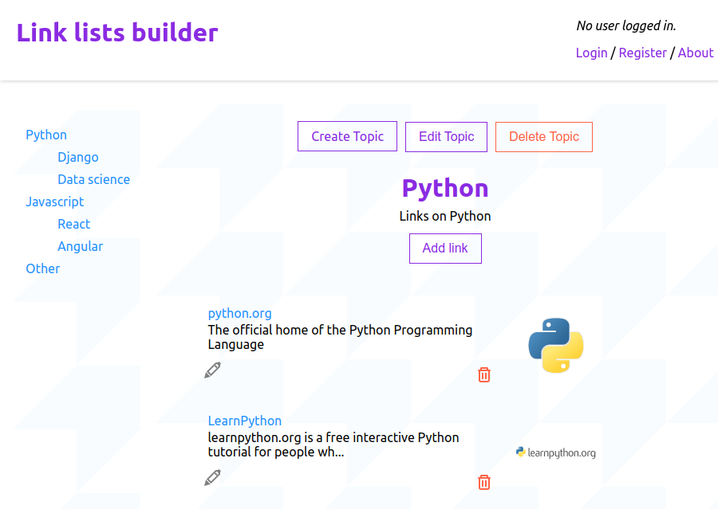

Angular single page application showing an editable portfolio of cryptocurrencies with a chart representing the balance and related news. Rates and news are fetched from external APIs.

### Stack:
- Angular 12
- Back-end in Firebase
- Bootstrap 5
- PrimeNG
- ngx-charts
- Coingecko API

[See the app on Vercel](https://crypto-balance.vercel.app/).

