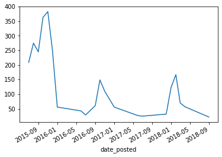

<details>
<summary>Table of contents</summary>

  * [Context:](#context-)
  * [Data retrieval](#data-retrieval-)
    + [Understanding Reddit data](#understanding-reddit-data)
    + [Getting the list of users](#getting-the-list-of-users)
    + [Extracting the usernames](#extracting-the-usernames)
    + [Fetching data from banned users](#fetching-data-from-banned-users)
  * [Data preparation and analysis with pandas](#data-preparation-and-analysis-with-pandas)
    + [Importing the data](#importing-the-data)
    + [Cleaning the data](#cleaning-the-data)
    + [Submitted and comments, the main dataframes used](#submitted-and-comments-the-main-dataframes-used)
    + [More cleaning](#more-cleaning)
    + [Creating the data subsets for analysis](#creating-the-data-subsets-for-analysis)
- [Reddit users banned for "interference", analysis with Python/Pandas](#reddit-users-banned-for-interference-analysis-with-pythonpandas)
    - [Technologies used](#technologies-used)
    - [Context: <a name="context"></a>](#context-)
    - [Data retrieval <a name="data-retrieval"></a>](#data-retrieval-)
      - [Understanding Reddit data](#understanding-reddit-data)
      - [Getting the list of users](#getting-the-list-of-users)
      - [Extracting the usernames](#extracting-the-usernames)
      - [Fetching data from banned users](#fetching-data-from-banned-users)
    - [Data preparation and analysis with pandas](#data-preparation-and-analysis-with-pandas)
      - [Importing the data](#importing-the-data)
      - [Cleaning the data](#cleaning-the-data)
      - [Submitted and comments, the main dataframes used](#submitted-and-comments-the-main-dataframes-used)
      - [More cleaning](#more-cleaning)
      - [Creating the data subsets for analysis](#creating-the-data-subsets-for-analysis)
  - [Analysis](#analysis)
    - [Users banned in 2018](#users-banned-in-2018)
      - [When were the accounts created?](#when-were-the-accounts-created)
      - [Where did they post their content?](#where-did-they-post-their-content)
    - [Users banned in 2019](#users-banned-in-2019)
      - [When were the accounts created?](#when-were-the-accounts-created-1)
      - [Where did they post their content?](#where-did-they-post-their-content-1)
    - [Yearly trends](#yearly-trends)
      - [Postings activity](#postings-activity)
    - [Comments activity](#comments-activity)
    - [Year 2016 - US Election](#year-2016---us-election)
    - [Spike in posts months prior to the 2016 election](#spike-in-posts-months-prior-to-the-2016-election)
    - [Comments pattern in 2016](#comments-pattern-in-2016)
    - [Year 2019 - UK Election](#year-2019---uk-election)
    - [Spike in posts months prior to the 2019 election](#spike-in-posts-months-prior-to-the-2019-election)
    - [Comments pattern in 2019](#comments-pattern-in-2019)
    - [Content analysis](#content-analysis)
      - [Sentiment analysis of posts](#sentiment-analysis-of-posts)
      - [Sentiment analysis of comments](#sentiment-analysis-of-comments)
      - [Words used in posts - users banned in 2018](#words-used-in-posts---users-banned-in-2018)
      - [Words used in posts - users banned in 2019](#words-used-in-posts---users-banned-in-2019)
      - [Comments by all users](#comments-by-all-users)
</details>

<hr/>

# Reddit users banned for "interference", analysis with Python/Pandas

<a id="top"></a>


### Technologies used
[Python 3](python.org/), [Pandas](pandas.pydata.org/), [Plotly Express](https://plotly.com/python/plotly-express/), [Jupyter Notebook](https://jupyter.org/)


### Context: <a name="context"></a>
In 2018 Reddit [banned 944 accounts](https://www.reddit.com/r/announcements/comments/8bb85p/reddits_2017_transparency_report_and_suspect/) on suspicion of interference by the Russian government in US politics.

A year later, it [banned 61 accounts](https://www.reddit.com/r/announcements/duplicates/e75f07/suspected_campaign_from_russia_on_reddit/) for interference with the December 2019 UK Election.

What was in common between these users? Were there some patterns in their postings? Did they target specific audiences?

To answer these questions, I first isolated the usernames written in the Reddit announcements and scraped the data associated with them, all with a Python script.

I then used [Pandas](https://pandas.pydata.org/) inside a [Jupyter Notebook](https://jupyter.org/) to perform some data analysis and visualizations.

***  

### Data retrieval <a name="data-retrieval"></a>

A Python script was used to extract the banned users' handles from the Reddit announcements and to gather the relevant data.

#### Understanding Reddit data

While Reddit [has an API ](https://www.reddit.com/dev/api), it turned out that simply adding <code>.json</code> to any Reddit page or post will display the raw data in json format.

<summary>Sample JSON data from reddit</summary>

```json
[{"kind": "Listing", "data": {"modhash": "", "dist": 1, "children": 
[{"kind": "t3", "data": {"approved_at_utc": null, "subreddit": "whatstheword", 
"selftext": "I was at the beach today for an hour. {..}", 
"user_reports": [], "saved": false, "mod_reason_title": null}}]}}]
```

There are hundreds of data points in any JSON generated by reddit, hence data cleaning was necessary from the beginning.


#### Getting the list of users

With the list of banned users provided by reddit [in the 2018 announcement](https://www.reddit.com/r/announcements/comments/8bb85p/reddits_2017_transparency_report_and_suspect/) and [in the 2019 announcement](https://www.reddit.com/r/announcements/duplicates/e75f07/suspected_campaign_from_russia_on_reddit/), it was simly a matter of adding <code>.json</code> to the posts and downloading the result in a new file for each.

The results are in [this file for the 2018 announcement](https://github.com/cd4d/data-analysis-reddit/blob/master/data-files/reddit-post-banning-users-2018.json) and [this file for the 2019 announcement](https://github.com/cd4d/data-analysis-reddit/blob/master/data-files/reddit-post-banning-users-2019.json).

A cursory look at the 2019 file will show the structure used by reddit for organizing its data. The first level of the data structure indicating the kind (post, comment, listing etc.) and the data itself contained in a key called <code>data</code>. 

#### Extracting the usernames

This is where the python script below is first used to extract all the username in the text of the annoucements in two arrays, as well as the date of the announcements. 

The 2019 post has the username inside the text, in the following path in the <code>JSON</code>:

```
data > children > data > selftext
```
The usernames where formatted like so in the 2019 post:

```
|[gregoratior](https://www.reddit.com/user/gregoratior)
|[LuzRun](https://www.reddit.com/user/LuzRun)
|[McDownes](https://www.reddit.com/user/McDownes)|
```

I then used a regex pattern to isolate the usernames then add them to a json file.

```python
pattern = r"(?<=user/).*?[^?/!\\)]*" \
```

The resulting json file containing usernames:

```json
{
  "2018-May-09": [
    "1488Reasons",
    "20twony",
    "Abena_Tau",
    "Admiraf",
    ...],
    "2019-Dec-06": [
    "alabelm",
    "almanzamary",
    "AntonioDiazz",
    "bellagara"]
}
```

<details>
<summary>Extracting usernames of the banned accounts</summary>

```python
def extract_users_list(*args ):
""" extracts a python list of reddit usernames from the json file of a reddit post 
(listing or wikipage) """
users_list = dict()
for filename in args:
    try:
        with open(filename) as f:
            filedata = json.load(f)
            try:
                # check if post is a reddit listing (2019 banwave)
                if type(filedata) == list and filedata[0]["kind"].casefold() == "Listing".casefold():
                    # Adding the text of the post under an entry names after date of banning
                    banwave_date = datetime.fromtimestamp(filedata[0]["data"]["children"][0]["data"]["edited"]).strftime("%Y-%b-%d")
                    content = filedata[0]["data"]["children"][0]["data"]["selftext"]
                    # regex pattern to catch username only from the post, filter special chars at the end
                    pattern = r"(?<=user/).*?[^?/!\\)]*" \
                
                # check if it's a reddit "wikipage" (2018 banwave)
                elif type(filedata) == dict and filedata["kind"].casefold() == "wikipage".casefold():
                    banwave_date = datetime.fromtimestamp(filedata["data"]["revision_date"]).strftime("%Y-%b-%d")
                    content = filedata["data"]["content_md"]
                    pattern = r"(?<=u/).*?[^\|]*"

                # build the set of unique usernames using regex pattern
                temp_users_list = sorted(set(re.findall(pattern, content)), key=str.casefold)
                users_list[banwave_date] = temp_users_list
```
</details>

<br/>

#### Fetching data from banned users

With that information, I wrote a function to the python script to automatically fetch data of the users.

This function takes a filename as argument as well as the reddit kind of data (post, comment...) and 
write the result to a new <code>JSON</code> file. I executed it on the previously built usernames list and got a new file containing all data related to said usernames.

<details>
<summary>build_users_database function</summary>

```python
def build_users_database(filename, *args):
""" requests json files for all the users in the reddit-list-banned-users.json file 
    and saves all the data in a new file for analysis with pandas """

    all_users = []
    with open(filename) as f:
        data = json.load(f)
        for k,v in data.items():
            for e in v:
                # creates a tuple ("username", "banwave year") for each user
                all_users.append((e, k))

    # sorts through the tuples in a case insensitive manner
    all_users.sort(key=lambda x: x[0].casefold() )   

    # do requests based on the list
    start_time = datetime.now()
    print(f"Starting scraping data from {len(all_users)} Reddit users at {start_time}")
    user_data = {}

    for user, ban_year in all_users:
        # first fetch the json file corresponding to the username and the attribute in the list i.e "about", "submitted" pages
        for attr in args:
            response = requests.get("https://www.reddit.com/user/" + user + "/" + attr +  ".json?raw_json=1", headers = USER_AGENT) # using headers to avoid error 429 https://stackoverflow.com/questions/34539129/parsing-reddit-json-into-python-array-and-print-items-from-array

            if user not in user_data: #initialize the dictionary with first json data
                try:
                    user_data[user] = {attr:json.loads(response.text)["data"]} #filter to the level with desired data
                except KeyError:
                    print("Key Error:", user)

            else: # or update the dictionary entry 
                try:
                    user_data[user].update({attr:json.loads(response.text)["data"]})
                except KeyError:
                    print(f"Key Error: {user}. Maybe user was suspended.")

        # finally, add banwave year for later analysis
        user_data[user].update({"banwave_year": ban_year})
```
</details>


<br/>
The resulting file contained 732,882 lines of data about 1001 usernames.


Here's a sample:


```json
{
  "1488Reasons": {
    "about": {
      "is_employee": false,
      "icon_img": "https://www.redditstatic.com/avatars/avatar_default_08_0079D3.png",
      "pref_show_snoovatar": false,
      "name": "1488reasons",
      "is_friend": false,
      "created": 1452960067.0,
      "has_subscribed": true,
      ...
      "subreddit": {
        "default_set": true,
        "user_is_contributor": null,
        "banner_img": "",
        "restrict_posting": true,
        ...
      },
      "has_verified_email": false,
      "id": "tu7sn",
      ...
    }
```


<details>
<summary>The whole Python script</summary>

```python
import json
import requests
import re
from datetime import datetime
import time
import os # used to get to the home directory cross platforms, "create data-files" directory

#global variables : url of posts, user-agent
# grab user-agent line from local file, see rules: https://github.com/reddit-archive/reddit/wiki/API
API_FILE = os.path.expanduser("~") + r"/.secrets/api/reddit-api.json"

# url of the posts
LINK_2018 = r"https://www.reddit.com/wiki/suspiciousaccounts" 
LINK_2019 = r"https://www.reddit.com/r/redditsecurity/comments/e74nml/"

# what data we want from reddit i.e the about page, submitted posts, comments etc.
user_data_attributes = ("about", "submitted", "comments", "gilded", "trophies")


# opening the credential files to get custom user-agent for the requests
# otherwise use a more generic line mentioning python
try:
with open(API_FILE) as f:
    USER_AGENT = {"user-agent": json.load(f)["user_agent"]} 
except FileNotFoundError:
    USER_AGENT = {"user-agent": "python/praw6:someapi:v0.0.1"}


class get_users_data:
""" class that takes url of the reddit posts and  creates a json file """
def __init__(self, url):
    self.url = url
    
def save_reddit_posts(self, filename):
    """ function that fetches reddit post  and returns a json file """
    response = requests.get(self.url + ".json?raw_json=1", headers=USER_AGENT)
    response_data = response.json()
    if not os.path.isdir("data-files"):
        os.mkdir("data-files")
    with open("data-files/" + filename, "w") as f:
        f.write(json.dumps(response_data, indent=2))


def extract_users_list(*args ):
""" extracts a python list of reddit usernames from the json file of a reddit post 
(listing or wikipage) """
users_list = dict()
for filename in args:
    try:
        with open(filename) as f:
            filedata = json.load(f)
            try:
                # check if post is a reddit listing (2019 banwave)
                if type(filedata) == list and filedata[0]["kind"].casefold() == "Listing".casefold():
                    # Adding the text of the post under an entry names after date of banning
                    banwave_date = datetime.fromtimestamp(filedata[0]["data"]["children"][0]["data"]["edited"]).strftime("%Y-%b-%d")
                    content = filedata[0]["data"]["children"][0]["data"]["selftext"]
                    # regex pattern to catch username only from the post, filter special chars at the end
                    pattern = r"(?<=user/).*?[^?/!\\)]*" \
                
                # check if it's a reddit "wikipage" (2018 banwave)
                elif type(filedata) == dict and filedata["kind"].casefold() == "wikipage".casefold():
                    banwave_date = datetime.fromtimestamp(filedata["data"]["revision_date"]).strftime("%Y-%b-%d")
                    content = filedata["data"]["content_md"]
                    pattern = r"(?<=u/).*?[^\|]*"

                # build the set of unique usernames using regex pattern
                temp_users_list = sorted(set(re.findall(pattern, content)), key=str.casefold)
                users_list[banwave_date] = temp_users_list

            except AttributeError:
                print("Try another file with reddit json structure")

        # writing to the file
        if not os.path.isdir("data-files"):
            os.mkdir("data-files")
        with open("data-files/reddit-list-banned-users.json", "w") as f:
            f.write(json.dumps(users_list, indent=2))

    except FileNotFoundError:
        print(filename, "file not found")

def build_users_database(filename, *args):
""" requests json files for all the users in the reddit-list-banned-users.json file 
    and saves all the data in a new file for analysis with pandas """

    all_users = []
    with open(filename) as f:
        data = json.load(f)
        for k,v in data.items():
            for e in v:
                # creates a tuple ("username", "banwave year") for each user
                all_users.append((e, k))

    # sorts through the tuples in a case insensitive manner
    all_users.sort(key=lambda x: x[0].casefold() )   

    # do requests based on the list
    start_time = datetime.now()
    print(f"Starting scraping data from {len(all_users)} Reddit users at {start_time}")
    user_data = {}

    for user, ban_year in all_users:
        # first fetch the json file corresponding to the username and the attribute in the list i.e "about", "submitted" pages
        for attr in args:
            response = requests.get("https://www.reddit.com/user/" + user + "/" + attr +  ".json?raw_json=1", headers = USER_AGENT) # using headers to avoid error 429 https://stackoverflow.com/questions/34539129/parsing-reddit-json-into-python-array-and-print-items-from-array

            if user not in user_data: #initialize the dictionary with first json data
                try:
                    user_data[user] = {attr:json.loads(response.text)["data"]} #filter to the level with desired data
                except KeyError:
                    print("Key Error:", user)

            else: # or update the dictionary entry 
                try:
                    user_data[user].update({attr:json.loads(response.text)["data"]})
                except KeyError:
                    print(f"Key Error: {user}. Maybe user was suspended.")

        # finally, add banwave year for later analysis
        user_data[user].update({"banwave_year": ban_year})

        # wait 10 seconds between API calls for each user: 
        # 60s / 10s delay * 5 requests for each users -> 30 rq/minute, reddit limit
        time.sleep(10.1) 

    # writing to the final file used for analysis
    if not os.path.isdir("data-files"):
        os.mkdir("data-files")

    with open("data-files/reddit-banned-users-DATA.json", "w") as f:
        f.write(json.dumps(user_data, indent=2))

    stop_time = datetime.now()
    print(f"Process finished at {stop_time}. It took {(stop_time - start_time)}")

""" getting the json data of the two reddit posts listing the banned users in 2018 and 2019,
uncomment to execute """
# reddit_2018 = get_users_data(LINK_2018)
# reddit_2019 = get_users_data(LINK_2019)

#reddit_2018.save_reddit_posts("reddit-post-banning-users-2018.json")
#reddit_2019.save_reddit_posts("reddit-post-banning-users-2019.json")

""" extracting the 1000+ users from the json data of the two reddit posts, uncomment to execute"""
# extract_users_list("data-files/reddit-post-banning-users-2018.json","data-files/reddit-post-banning-users-2019.json")

""" fetching the data from all users in the list, takes 2hrs+ with delay between requests. Uncomment to execute"""
#build_users_database("data-files/reddit-list-banned-users.json", *user_data_attributes)
```
</details>

### Data preparation and analysis with pandas

[Top of page](#top)

I imported the resulting data in a [Jupyter Notebook](https://github.com/cd4d/data-analysis-reddit/blob/master/project-reddit-analysis.ipynb) to clean it and make visualizations.

Given the size of the notebook, I will summarize the main actions and results below.

#### Importing the data

```python
# import the json file containing data on 1001 banned Reddit users
rawdata = pd.read_json("data-files/reddit-banned-users-DATA.json")
rawdata.head()
```

From the Python script I selected 6 kind of main data points for each user : 
- **about** containing information about the user
- **submitted** listing the posts the user created
- **comments** listing the comments made by the user
- **gilded** whether the user was awarded reddit gold
- **trophies** various rewards by reddit such as 1 year membership
- **banwave_year** the year the user was banned i.e 2018 or 2019

As shown below, the data in each of these columns was still nested as <code>JSON</code> objects. 

<div>
<style scoped>
    .dataframe tbody tr th:only-of-type {
        vertical-align: middle;
    }

    .dataframe tbody tr th {
        vertical-align: top;
    }

    .dataframe thead th {
        text-align: right;
    }
</style>
<table border="1" class="dataframe">
  <thead>
    <tr style="text-align: right;">
      <th></th>
      <th>about</th>
      <th>submitted</th>
      <th>comments</th>
      <th>gilded</th>
      <th>trophies</th>
      <th>banwave_year</th>
    </tr>
  </thead>
  <tbody>
    <tr>
      <th>1488Reasons</th>
      <td>{'is_employee': False, 'icon_img': 'https://ww...</td>
      <td>{'modhash': '', 'dist': 1, 'children': [{'kind...</td>
      <td>{'modhash': '', 'dist': 25, 'children': [{'kin...</td>
      <td>{'modhash': '', 'dist': 0, 'children': [], 'af...</td>
      <td>{'trophies': [{'kind': 't6', 'data': {'icon_70...</td>
      <td>2018-May-09</td>
    </tr>
    <tr>
      <th>20twony</th>
      <td>{'is_employee': False, 'icon_img': 'https://ww...</td>
      <td>{'modhash': '', 'dist': 1, 'children': [{'kind...</td>
      <td>{'modhash': '', 'dist': 0, 'children': [], 'af...</td>
      <td>{'modhash': '', 'dist': 0, 'children': [], 'af...</td>
      <td>{'trophies': [{'kind': 't6', 'data': {'icon_70...</td>
      <td>2018-May-09</td>
    </tr>
    <tr>
      <th>Abena_Tau</th>
      <td>{'is_employee': False, 'icon_img': 'https://ww...</td>
      <td>{'modhash': '', 'dist': 18, 'children': [{'kin...</td>
      <td>{'modhash': '', 'dist': 0, 'children': [], 'af...</td>
      <td>{'modhash': '', 'dist': 0, 'children': [], 'af...</td>
      <td>{'trophies': [{'kind': 't6', 'data': {'icon_70...</td>
      <td>2018-May-09</td>
    </tr>
    <tr>
      <th>Admiraf</th>
      <td>{'is_employee': False, 'icon_img': 'https://ww...</td>
      <td>{'modhash': '', 'dist': 1, 'children': [{'kind...</td>
      <td>{'modhash': '', 'dist': 0, 'children': [], 'af...</td>
      <td>{'modhash': '', 'dist': 0, 'children': [], 'af...</td>
      <td>{'trophies': [{'kind': 't6', 'data': {'icon_70...</td>
      <td>2018-May-09</td>
    </tr>
    <tr>
      <th>AdofynMorakus</th>
      <td>{'is_employee': False, 'icon_img': 'https://ww...</td>
      <td>{'modhash': '', 'dist': 1, 'children': [{'kind...</td>
      <td>{'modhash': '', 'dist': 0, 'children': [], 'af...</td>
      <td>{'modhash': '', 'dist': 0, 'children': [], 'af...</td>
      <td>{'trophies': [{'kind': 't6', 'data': {'icon_70...</td>
      <td>2018-May-09</td>
    </tr>
  </tbody>
</table>
</div>

#### Cleaning the data

I created temporary dataframes in order to reach the data nested. 

```python
#deeper levels of nesting
temp_trophies = json_normalize(rawdata["trophies"])
gilded = json_normalize(rawdata["gilded"])

# submitted and comments have deeper levels of nested json
temp_submitted = json_normalize(rawdata["submitted"])
temp_comments = json_normalize(rawdata["comments"])
```

To reach the data nested in the *comments*, *submitted* and *trophies* sections, I wrote a function that iterates through the data and appends it to a new list once it reached the data.

```python
# get to the "data" field in nested levels for "comments", "submitted" and "trophies"
def go_to_data(node):
    lst = []
    for i in range(len(node)): # iterate through data series
        entry = node.loc[i] # for clarity
        if "children" in node:
            container = "children"
        elif "trophies" in node:
            container = "trophies"
        if len(entry[container]) > 0: 
            for j in range(len(entry[container])):
                lst.append(entry[container][j]["data"])
    return json_normalize(lst)

submitted =  go_to_data(temp_submitted)
comments =  go_to_data(temp_comments)
trophies = go_to_data(temp_trophies)
```

#### Submitted and comments, the main dataframes used

A reddit user is characterized by what content they create or share and what comments they make. Hence I focused on the the *submitted* and *comments* dataframes obtained through the first stage of the data cleaning process.

```python
comments.shape
    (1736, 40)
```

```python
submitted.shape
    (3933, 359)
```

#### More cleaning

While the *comments* dataframe had a manageable 40 columns, *submitted* had 359, requiring more cleaning.

Dropping duplicates is a start

```python
# dropping duplicates values
submitted.drop_duplicates(subset="name", keep='first', inplace=True)
comments.drop_duplicates(subset="body", keep='first', inplace=True)
about.drop_duplicates(subset="name", keep='first', inplace=True)
```

I extracted information about metadata such as the url of images posted by users. Reddit organizes it in the json as such: media_metadata > s > u (url of image).

```python
# isolating nested media_metadata data: url (s.u) type (m))
metadata_col_type = [ x for x in [x for x in submitted.columns if "media_metadata" in x] if ".m" in x]
metadata_col_url = [ x for x in [x for x in submitted.columns if "media_metadata" in x] if "s.u" in x]
metadata_col_id = [ x for x in [x for x in submitted.columns if "media_metadata" in x] if ".id" in x]
```
I then added the metadata information to new columns to the *submitted* dataframe in case of need.

```python
# consolidating the 60 metadata id and url columns into two new columns
submitted["metadata_type"] = submitted[metadata_col_type].apply(lambda x: "".join(x.dropna().astype(str)), axis=1)
submitted["metadata_url"] = submitted[metadata_col_url].apply(lambda x: "".join(x.dropna().astype(str)), axis=1)
submitted["metadata_id"] = submitted[metadata_col_id].apply(lambda x: "".join(x.dropna().astype(str)), axis=1)
```

More cleaning followed

```python
# removing columns with "media_metadata" except type ("m") unique id and url
submitted.drop([x for x in submitted.columns if "media_metadata" in x and x != "metadata_col_type" and x != "metadata_col_url" and x != "metadata_col_id"], axis=1, inplace=True)
submitted.drop([x for x in submitted.columns if "secure_media" in x], axis=1, inplace=True)
submitted.drop([x for x in submitted.columns if "media_embed" in x], axis=1, inplace=True)
# removing media_oembed columns except "provider_name", "type", "url", "author_name"
submitted.drop([x for x in submitted.columns if "media.oembed" in x and x != "media.oembed.provider_name" and x != "media.oembed.type" and x != "media.oembed.url" and x != "media.oembed.author_name"], axis=1, inplace=True)

#removing columns about "flair"
submitted.drop([x for x in submitted.columns if "flair" in x], axis=1, inplace=True)
comments.drop([x for x in comments.columns if "flair" in x], axis=1, inplace=True)
#removing columns about "thumbnail"
submitted.drop([x for x in submitted.columns if "thumbnail" in x], axis=1, inplace=True)
comments.drop([x for x in comments.columns if "thumbnail" in x], axis=1, inplace=True)
# removing columns with "subreddit" in "about" since they all contain users subreddits
about.drop([x for x in about.columns if "subreddit" in x], axis=1, inplace=True)
# removing the u_reddit subreddit
submitted.drop(submitted[submitted["subreddit"] == "u_reddit"].index, inplace=True)
# dropping columns with all n/a values
submitted.dropna(axis=1, how="all", inplace=True)
comments.dropna(axis=1, how="all", inplace=True)
about.dropna(axis=1, how="all", inplace=True)
#other columns
to_drop_submitted = ["subreddit_name_prefixed", "wls", "pwls", "allow_live_comments", 
                     "content_categories", "preview.enabled", "whitelist_status", "send_replies",
                    "post_hint", "is_robot_indexable","suggested_sort", "author_premium", "all_awardings",
                    "preview.images", "preview.enabled", "subreddit_id", "parent_whitelist_status"]
to_drop_comments = ["subreddit_name_prefixed", "all_awardings", "author_premium", "permalink"]
submitted.drop(to_drop_submitted, axis=1, inplace=True)
comments.drop(to_drop_comments, axis=1, inplace=True)
```


```python
# select all columns where same value is in all rows
def show_same_values(node):
    return [x for x in node.columns if node[x].value_counts().iloc[0] == len(node[x])]
```


```python
# drop these same values columns from the data
submitted.drop(same_values_submitted, axis=1, inplace=True)
comments.drop(same_values_comments, axis=1, inplace=True)
```


Reddit stores the dates in [Unix time](https://en.wikipedia.org/wiki/Unix_time), I wrote a function to convert them in a usable format. 

```python
# date conversion of "created_utc" and "edited" fields in "comments" and "submitted" tables
def convert_dates(*args):
    for node in args: #dealing with subsets
        if "created_x_utc" in node.columns:
            node["date_posted"] = pd.to_datetime(node["created_x_utc"], unit="s")
        else:
            node["date_created"] = pd.to_datetime(node["created_utc"], unit="s")
            node["year_graph"] = pd.DatetimeIndex(node["date_created"]).year
            node["year"] = pd.PeriodIndex(node["date_created"], freq='A')
            node["month_nr"] = pd.PeriodIndex(node["date_created"], freq="M")
            node["month"] = pd.DatetimeIndex(node["date_created"]).month_name()
            node["day"] =pd.PeriodIndex(node["date_created"], freq="D")
            node["day_of_week"] = pd.DatetimeIndex(node["date_created"]).day_name()       

convert_dates(submitted, comments, about)
# rename "date_created" columns in submitted and columns to avoid confusion
submitted.rename(columns={"date_created": "date_posted"}, inplace=True)
comments.rename(columns={"date_created": "date_posted"}, inplace=True)
```
#### Creating the data subsets for analysis

I separated the cleaned data according to the year when users were banned.

```python
# creating subsets reflecting the 2018 and 2019 banwaves
about_banwave_2018 = about[about["banwave_year"] == "2018-May-09"]
about_banwave_2019 = about[about["banwave_year"] == "2019-Dec-06"]

# merging with submitted and comments df using "about["name"]" and "["author"]" as key
submitted_banwave_2018 = submitted.merge(about_banwave_2018, how="inner", left_on="author", right_on="name")
submitted_banwave_2019 = submitted.merge(about_banwave_2019, how="inner", left_on="author", right_on="name")
comments_banwave_2018 = comments.merge(about_banwave_2018, how="inner", left_on="author", right_on="name")
comments_banwave_2019 = comments.merge(about_banwave_2019, how="inner", left_on="author", right_on="name")
```

## Analysis

In this section the code used to display the visualization is hidden by default.

### Users banned in 2018

#### When were the accounts created?

<details>
<summary>Code</summary>

```python
# Create the figure and the axes
fig, ax = plt.subplots()
# Set limits and labels
ax.set(title='Date of creation')

banned_2018 = about_banwave_2018.groupby(["year", "month"]).count().sort_values(by="year")["id"].plot(kind="line")
plt.xticks(rotation=25)
```
</details>


Almost all the users banned in 2018 created their accounts in early 2015, 3 years before being banned and 1 year and a half before the 2016 US presidential elections.

#### Where did they post their content?

<details>
<summary>Code</summary>

```python
top_subreddits_2018 = submitted_banwave_2018.groupby("subreddit", as_index=False).count().sort_values(by="score", ascending=False).head()
fig = px.bar(top_subreddits_2018.sort_values(by="score", ascending=True), y="subreddit", x="score",  orientation='h',
             hover_data=["subreddit"], color="score",
             labels={'Score':'Nr of posts'}, height=400
            )
fig.show(renderer="png")
```
</details>


Looking at the popularity of these subreddit we have (as of July 2020):
- [r/funny](https://www.reddit.com/r/funny/): 31.8m subscribers
- [r/politicalhumor](https://www.reddit.com/r/politicalhumor/): 1m subscribers
- [r/cryptocurrency](https://www.reddit.com/r/cryptocurrency/): 1.1m subscribers
- [r/gifs](https://www.reddit.com/r/gifs/): 20.2m subscribers
- [r/aww](https://www.reddit.com/r/aww/): 25.7m subscribers

The users posted in popular and uncontroversial subreddits as well as more niche ones. [r/funny](https://www.reddit.com/r/funny/), [r/gifs](https://www.reddit.com/r/gifs/) and [r/aww](https://www.reddit.com/r/aww/) could have been used to easily get reddit karma which are points awarded by other reddit users to appreciate a comment or a post. A user with a high karma score is usually seen as reputable and influential.

The other subreddits, [r/politicalhumor](https://www.reddit.com/r/politicalhumor/) and [r/cryptocurrency](https://www.reddit.com/r/cryptocurrency/) have less following but by the nature of their topics can be readily used to convey political message. 

### Users banned in 2019

While the number of users banned in 2019 is much smaller than that of 2018 (61 vs. 944), we can still look into the same question to see if there are similarities.

#### When were the accounts created?

<details>
<summary>Code</summary>

fig, ax = plt.subplots()
ax.set(title='Date of creation')
about_banwave_2019.groupby(["year", "month"]).count().sort_values(by="year")["id"].plot(kind="line")
plt.xticks(rotation=25)
</details>


There is a big spike in accounts creation in mid 2019 and smaller ones in the preceding years starting mid 2017.  

#### Where did they post their content?

<details>
<summary>Code</summary>

```python
#top_subreddits_2019.sort_values().plot(kind="barh")
top_subreddits_2019 = submitted_banwave_2019.groupby("subreddit", as_index=False).count().sort_values(by="score", ascending=False).head(7)
fig = px.bar(top_subreddits_2019.sort_values(by="score", ascending=True), y="subreddit", x="score",  orientation='h',
             hover_data=["subreddit"], color="score",
             labels={'Score':'Nr of posts'}, height=400
            )
fig.show(renderer="png")
```
</details>


This graph is much different than the 2018 one. It is clear that the users were focused on European issues, with the most used subreddits being (as of july 2020):

- [europe](https://www.reddit.com/r/europe/): 2.5m users
- [spain](https://www.reddit.com/r/spain/): 45k users
- [es](https://www.reddit.com/r/es/): 50k users
- [espanol](https://www.reddit.com/r/espanol/): 37k users
- [noticias_en_espanol](https://www.reddit.com/r/noticias_en_espanol/) 968 users
- [vzla](https://www.reddit.com/r/vzla): 62k users
- [france](https://www.reddit.com/r/france/): 366k users

However the sample size being so small, it would just take a few banned users to skew the results. Nonetheless, it seems that the efforts of the users were targeted at a different audience than in 2018.

### Yearly trends

#### Postings activity

<details>
<summary>Code</summary>

```python
#  Posts 
yearly_trend_submitted = submitted[["score", "author", "subreddit", "title","date_posted"]]
monthly_trend = yearly_trend_submitted.groupby(pd.Grouper(key='date_posted', freq='M'), as_index=False).size().sort_index()
monthly_trend[monthly_trend > 20].plot()
```
</details>


Of notice is the large spike in postings in late 2015, followed by smaller ones in late 2016 and mid 2018. 

### Comments activity

<details>
<summary>Code</summary>

```python
#  Comments 
yearly_trend_comments = comments[["score", "author", "subreddit","link_title", "body","date_posted"]].sort_values(by="score", ascending=False)
yearly_trend_comments.groupby(pd.Grouper(key='date_posted', freq='M')).size().plot()
```
</details>



As for comments, 2015-2017 were active years but the large spike of activity is in the first qurter of 2018.

### Year 2016 - US Election

### Spike in posts months prior to the 2016 election

<details>
<summary>Code</summary>

```python
#  Posts for the year 2016 - peak in september 2016
top_2016_submitted = submitted[submitted["year"] == "2016"].sort_values(by="score", ascending=False)
top_2016_submitted.groupby(pd.Grouper(key='date_posted', freq='M')).size().plot()
```
</details>


If we look at the data from 2016, there is a clear spike of posting activity in the months prior to the November 2016 US election.

###  Comments pattern in 2016

<details>
<summary>Code</summary>

```python
#  Comments for the year 2016 - 
comments_2016 = comments[comments["year"] == "2016"].sort_values(by="id", ascending=False)
comments_2016.groupby(pd.Grouper(key='date_posted', freq='M')).size().plot()
```
</details>


The comments follow a similar pattern throughout the year.

### Year 2019 - UK Election

### Spike in posts months prior to the 2019 election

<details>
<summary>Code</summary>

```python
#  Posts for the year 2019 - 
top_2019_submitted = submitted[submitted["year"] == "2019"][["score", "author", "subreddit", "title","date_posted"]].sort_values(by="score", ascending=False)
top_2019_submitted.groupby(pd.Grouper(key='date_posted', freq='M')).size().plot()
```
</details>


###  Comments pattern in 2019

<details>
<summary>Code</summary>

```python
#  Comments for the year 2019 - 
top_2019_comments = comments[comments["year"] == "2019"].sort_values(by="score", ascending=False)
top_2019_comments.groupby(pd.Grouper(key='date_posted', freq='M')).size().plot()
```
</details>


### Content analysis

<details>
<summary>Code</summary>

```python
# https://github.com/dend/data-explorations/blob/master/notebooks/sentiment-analysis-reddit.ipynb
sia = SentimentIntensityAnalyzer()
def analyze_content(title):
    text_list = []
    for line in title:
        pol_score = sia.polarity_scores(line)
        pol_score['text'] = line
        text_list.append(pol_score)
    result = pd.DataFrame.from_records(text_list)
    result["sentiment"] = 0
    result.loc[result["compound"] > 0.1, "sentiment"] = "positive"
    result.loc[result["compound"] < -0.1, "sentiment"] = "negative"
    result.loc[result["compound"].between(-0.1, 0.1) , "sentiment"] = "neutral"
    return result

sentiment_analysis_submitted = analyze_content(submitted["title"])
sentiment_analysis_comments = analyze_content(comments["body"])
sentiment_analysis_submitted_banwave_2019 = analyze_content(submitted_banwave_2019["title"])
```
</details>


#### Sentiment analysis of posts

<details>
<summary>Code</summary>

```python
group = sentiment_analysis_submitted.groupby("sentiment", as_index=False).count()
colors = ["lightcoral", "lightblue", "lightgreen"]
fig = go.Figure(data=[go.Bar(x=group["sentiment"], y=group["pos"], orientation='v',
                    marker_color=colors,)])

fig.update_layout(title_text="Sentiment analysis of posts")
fig.show(renderer="png")
```
</details>


TODO

#### Sentiment analysis of comments

<details>
<summary>Code</summary>

```python
group = sentiment_analysis_comments.groupby("sentiment", as_index=False).count()
fig = go.Figure(data=[go.Bar(x=group["sentiment"], y=group["pos"], orientation='v',
                    marker_color=colors,)])

fig.update_layout(title_text="Sentiment analysis of comments")
fig.show(renderer="png")
```
</details>


TODO

#### Words used in posts - users banned in 2018


<details>
<summary>Code</summary>

```python
# Wordcloud of submission titles users banned in 2018
submitted_2018_wordcloud = WordCloud(max_words=15, background_color="white").generate(' '.join(submitted_banwave_2018_stemmed_text))

plt.imshow(submitted_2018_wordcloud, interpolation="bilinear")
plt.axis("off")
plt.show()
```
</details>


#### Words used in posts - users banned in 2019


<details>
<summary>Code</summary>

```python
# Wordcloud of submitssion titles users banned in 2019
submitted_2019_wordcloud = WordCloud(collocations=True, max_words=15, background_color="white").generate(' '.join(submitted_banwave_2019_lemmarized_text))
plt.imshow(submitted_2019_wordcloud, interpolation="bilinear")
plt.axis("off")
plt.show()
```
</details>


#### Comments by all users

<details>
<summary>Code</summary>

```python
# wordcloud of all comments
comments_wordcloud = WordCloud(max_words=15, background_color="white").generate(" ".join(comments_lemmarized_text))
plt.imshow(comments_wordcloud, interpolation="bilinear")
plt.axis("off")
plt.show()
```
</details>


