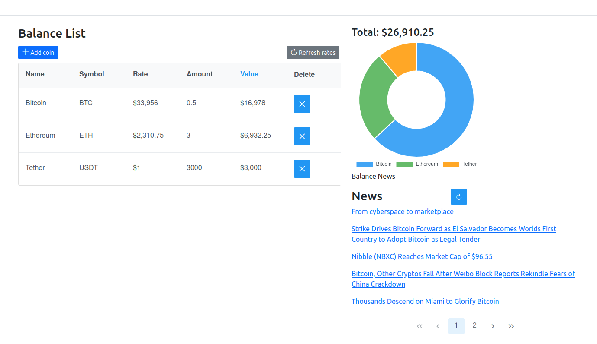

## [Redux app demo](https://react-redux-crypto-balance.vercel.app/)

## [Hooks app demo](https://react-crypto-balance.vercel.app/)

A React hooks and React-redux version of the [Angular](angular.html) single page application showing an editable portfolio of cryptocurrencies with a chart representing the balance and related news. Rates and news are fetched from external APIs.

### Stack:
- React 17
- Redux version
- - Redux-toolkit w. createAsyncThunk
- Hooks version
- - useEffect,useCallback
- Bootstrap 5
- PrimeReact
- Charts.js
- Coingecko API
- Context

