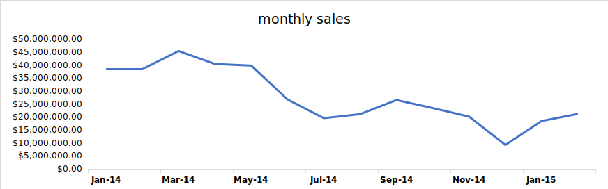
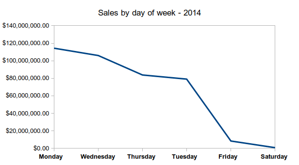
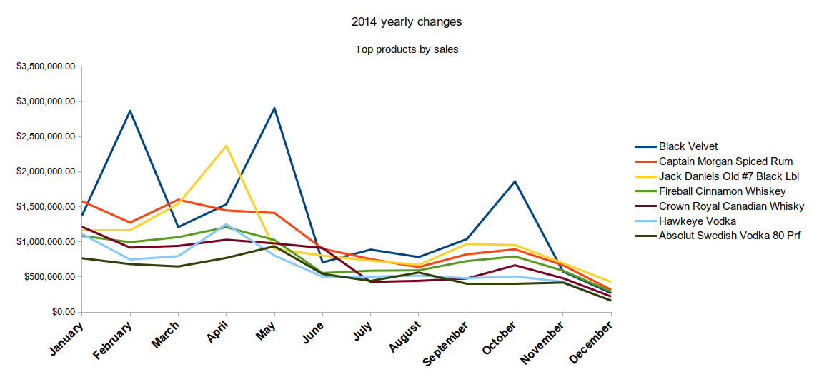
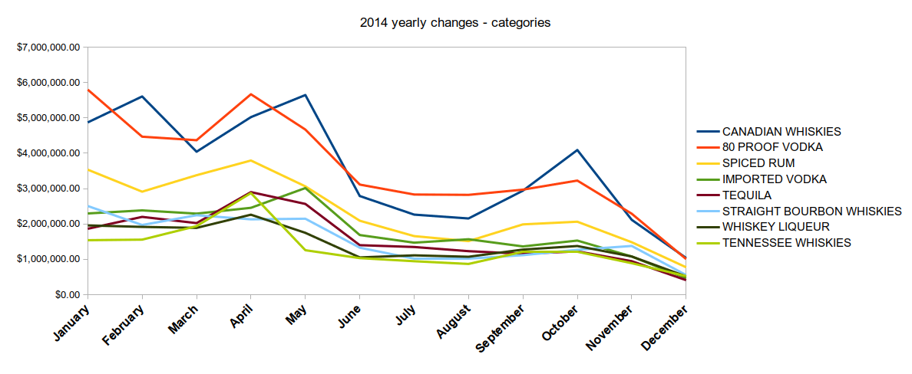
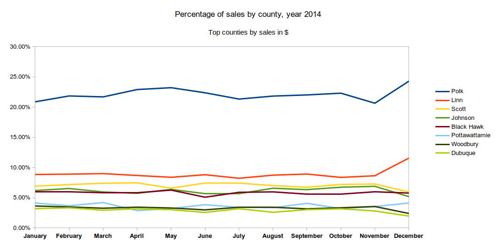

Table of Contents

[Findings: 2](#findings)

[Wrong data on the 2 most expensive bottles?
2](#wrong-data-on-the-2-most-expensive-bottles)

[Counties 2](#counties)

[Per capita spending – counties with 100k+ population
2](#per-capita-spending-counties-with-100k-population)

[Per store sales over the period – counties with 100k+ population
3](#per-store-sales-over-the-period-counties-with-100k-population)

[Stores 4](#stores)

[Products 5](#products)

[10 products make 25% of all sales in $
5](#products-make-25-of-all-sales-in)

[Total sales: $392,293,023 5](#total-sales-392293023)

[Margins 7](#margins)

[Timeframe 9](#timeframe)

[Daily trend 9](#daily-trend)

[No data on Sundays: 9](#no-data-on-sundays)

[Analysis 12](#__RefHeading___Toc1091_560194899)

[Counties: 12](#__RefHeading___Toc1093_560194899)

[Stores: 12](#__RefHeading___Toc1095_560194899)

[Products: 12](#__RefHeading___Toc1097_560194899)

[Yearly changes: 12](#__RefHeading___Toc1099_560194899)

# 

1.  #   
    Findings:
    
    1.  ### **Wrong data on the 2 most expensive bottles?**

*Absolut w/ Zing Zang Bloody Mary Mix:* is $1599 state cost / $2398 per
bottle

*Absolut Zing Zang Bloody Mary Mix:* $11.49/ $17.24 per bottle

*Cedar Ridge Barrel Proof Bourbon:* only 2 sales of 1 bottle each at
convenience stores.

Real cost should be around $40/bottle

Sources:
<http://whiskeyreviewer.com/2017/09/cedar-ridge-bourbon-review-092217/>
[https://www.wine-searcher.com/find/cedar%20ridge%20distil%20bourbon%20whisky%20iowa%20usa\#t](https://www.wine-searcher.com/find/cedar%20ridge%20distil%20bourbon%20whisky%20iowa%20usa#t1)1

1.  ## **Counties**
    
    2.  ### **Per capita spending – counties with 100k+ population**

|            |                |                    |                  |                        |
| ---------- | -------------- | ------------------ | ---------------- | ---------------------- |
| **County** | **Population** | **nr\_of\_stores** | **total\_sales** | **sales\_per\_capita** |
| Polk       | 430640         | 197                | $86,397,461.79   | $200.63                |
| Linn       | 211226         | 102                | $34,460,047.49   | $163.14                |
| Scott      | 165224         | 64                 | $27,902,848.67   | $168.88                |
| Black Hawk | 131090         | 78                 | $22,967,283.29   | $175.20                |
| Johnson    | 130882         | 49                 | $24,200,402.25   | $184.90                |
| Woodbury   | 102172         | 40                 | $13,242,016.16   | $129.61                |

**Linn, while being the second most populated county, has similar sales
results as smaller counties will fewer stores.
**

### **Per store sales over the period – counties with 100k+ population**

|            |                |                    |                  |                       |
| ---------- | -------------- | ------------------ | ---------------- | --------------------- |
| **County** | **Population** | **nr\_of\_stores** | **total\_sales** | **sales\_per\_store** |
| Polk       | 430640         | 197                | $86,397,461.79   | $438,565.80           |
| Linn       | 211226         | 102                | $34,460,047.49   | $337,843.60           |
| Scott      | 165224         | 64                 | $27,902,848.67   | $435,982.01           |
| Black Hawk | 131090         | 78                 | $22,967,283.29   | $294,452.35           |
| Johnson    | 130882         | 49                 | $24,200,402.25   | $493,885.76           |
| Woodbury   | 102172         | 40                 | $13,242,016.16   | $331,050.40           |

**Linn, Black Haw and Woodbury have smaller sales per store compared to
the other
counties.**

## Stores

| **Name**                            | **County** | **Nr of sales** | **Total sales** | **Avg sales** | **% of sales 100+ btl** |
| ----------------------------------- | ---------- | --------------- | --------------- | ------------- | ----------------------- |
| Hy-vee \#3 / Bdi / Des Moines       | Polk       | 2046            | $13,920,087.22  | $472.43       | 9%                      |
| Central City 2                      | Polk       | 2143            | $11,942,399.97  | $462.40       | 10%                     |
| Sam's Club 6344 / Windsor Heights   | Polk       | 1310            | $6,159,480.06   | $1,106.23     | 35%                     |
| Sam's Club 8162 / Cedar Rapids      | Linn       | 1477            | $5,734,721.57   | $803.75       | 30%                     |
| Hy-vee Wine and Spirits / Iowa City | Johnson    | 2401            | $5,665,143.70   | $235.67       | 6%                      |
| Costco Wholesale \#788              | Dallas     | 877             | $4,907,465.88   | $1,825.69     | 32%                     |
| Lot-a-spirits                       | Scott      | 1302            | $4,289,169.59   | $319.73       | 3%                      |
| Sam's Club 8238 / Davenport         | Scott      | 1021            | $3,308,625.56   | $623.56       | 24%                     |
| **Average**                         | **1572**   | **$6,990,886**  | **$731.18**     | **18.45%**    |                         |

**The top 10 stores in total sales on average have 18.45% transaction
involving 100+ bottles. This indicates that sales are more consumer
oriented than
wholesale.**

3.  ## Products
    
    2.  ### **10 products make 25% of all sales in $**
        
        1.  #### Total sales: $392,293,023

|                                |                                    |                |                      |
| ------------------------------ | ---------------------------------- | -------------- | -------------------- |
| **Description**                | **Category**                       | **Sales**      | **% of total sales** |
| Black Velvet                   | CANADIAN WHISKIES                  | $18,315,550.64 | 4.67%                |
| Captain Morgan Spiced Rum      | SPICED RUM                         | $13,772,752.25 | 3.51%                |
| Jack Daniels Old \#7 Black Lbl | TENNESSEE WHISKIES                 | $13,701,656.82 | 3.49%                |
| Fireball Cinnamon Whiskey      | WHISKEY LIQUEUR                    | $10,622,967.34 | 2.71%                |
| Crown Royal Canadian Whisky    | CANADIAN WHISKIES                  | $9,714,022.78  | 2.48%                |
| Hawkeye Vodka                  | 80 PROOF VODKA                     | $8,730,823.84  | 2.23%                |
| Absolut Swedish Vodka 80 Prf   | IMPORTED VODKA                     | $7,431,864.05  | 1.89%                |
| Grey Goose Vodka               | IMPORTED VODKA                     | $6,444,939.38  | 1.64%                |
| Jagermeister Liqueur           | MISC. IMPORTED CORDIALS & LIQUEURS | $6,298,430.40  | 1.61%                |
| Jim Beam                       | STRAIGHT BOURBON WHISKIES          | $5,163,920.19  | 1.32%                |
| **Total**                      | $100,196,927.69                    | 25.54%         |                      |

|                                |                   |              |                 |           |
| ------------------------------ | ----------------- | ------------ | --------------- | --------- |
| **Item**                       | **avg btl price** | **avg sale** | **avg btl qty** | **count** |
| Black Velvet                   | $10.17            | $225.85      | 20.62           | 81,095    |
| Hawkeye Vodka                  | $7.31             | $117.56      | 16.06           | 74,264    |
| Seagrams 7 Crown Bl Whiskey    | $12.40            | $109.43      | 8.95            | 39,577    |
| Captain Morgan Spiced Rum      | $17.65            | $367.78      | 20.48           | 37,448    |
| Smirnoff Vodka 80 Prf          | $11.82            | $134.95      | 11.77           | 36,136    |
| Fireball Cinnamon Whiskey      | $15.58            | $294.55      | 18.47           | 36,065    |
| Jack Daniels Old \#7 Black Lbl | $25.33            | $385.22      | 15.36           | 35,568    |
| Absolut Swedish Vodka 80 Prf   | $19.28            | $224.27      | 11.02           | 33,138    |
| Bacardi Superior Rum           | $13.40            | $150.40      | 10.8            | 32,552    |
| Jim Beam                       | $16.16            | $161.85      | 9.88            | 31,906    |
| *Top 10 average*               | *$14.77*          | *$223.33*    | *14.84*         | *45,094*  |
| *All sales average*            | *$14.37*          | *$128.62*    | *9.86*          |           |

**The top 10 products by unit sold all have at least 8 bottles sold per
transaction with an average of 14.84 bottles sold per transaction, which
is higher than the average of all sales. Also, of note is that the
average transaction of these products is higher by almost $100 than all
the
sales.**

## **Margins**

| **Description**                | **Bottle price avg.** | **Bottle state cost avg** | **Total profit** | **Margin %** | **nr\_sales** |
| ------------------------------ | --------------------- | ------------------------- | ---------------- | ------------ | ------------- |
| Black Velvet                   | $10.17                | $6.75                     | $6,144,705.67    | 50.69        | 81095         |
| Captain Morgan Spiced Rum      | $17.65                | $11.77                    | $4,590,286.75    | 49.99        | 37448         |
| Jack Daniels Old \#7 Black Lbl | $25.33                | $16.88                    | $4,567,750.22    | 50.01        | 35568         |
| Fireball Cinnamon Whiskey      | $15.58                | $10.39                    | $3,541,448.72    | 50.01        | 36065         |
| Crown Royal Canadian Whisky    | $24.99                | $16.66                    | $3,237,724.15    | 50           | 28453         |
| Hawkeye Vodka                  | $7.31                 | $4.87                     | $2,913,004.84    | 50.07        | 74264         |
| Absolut Swedish Vodka 80 Prf   | $19.28                | $12.84                    | $2,482,433.43    | 50.21        | 33138         |
| Grey Goose Vodka               | $24.23                | $16.14                    | $2,149,997.33    | 50.1         | 27845         |
| Jagermeister Liqueur           | $17.81                | $11.87                    | $2,099,928.40    | 50.02        | 28714         |
| Jim Beam                       | $16.16                | $10.74                    | $1,730,013.78    | 50.44        | 31906         |

**Almost all products have a margin around
50%**

| **Description**                                     | **Total profit** | **Margin %** | **nr\_sales** |
| --------------------------------------------------- | ---------------- | ------------ | ------------- |
| Jim Beam Operation Homefront                        | $83,589.16       | 124.43       | 238           |
| Jose Cuervo Silver w/1L Classic Light Margarita Mix | $19,451.58       | 106.41       | 120           |
| Maestro Dobel                                       | $5,356.08        | 86.74        | 60            |
| Ole Smoky Apple Pie w/Flask                         | $1,897.92        | 78.36        | 50            |
| Passion XO Pink                                     | $324.22          | 72.83        | 24            |
| Passion XO Blue                                     | $391.30          | 70.37        | 26            |
| Jose Cuervo Gold w/1L Classic Margarita Mix         | $25,767.13       | 70.08        | 214           |
| Passion XO Sun                                      | $301.86          | 69.33        | 18            |
| Absolut Tune                                        | $3,234.32        | 58.73        | 60            |
| Skyy Infusions Texas Grapefruit                     | $836.67          | 58.52        | 19            |

**The only products with a margin higher than 50% are niche products.**

## **Timeframe**

**Significant drop in sales from May 2014 onward.**

##### Daily trend

**Most sales are made at the start of the week.**

##### **No data on Sundays:**

*Only Class E liquor licensees (carryout liquor) and Class B wine
permittees (carryout wine) have a Sunday sales privilege as part of
their basic license. *

***Source:
[https://abd.iowa.gov/alcohol/alcohol-laws/hours-sale](https://abd.iowa.gov/alcohol/alcohol-laws/hours-sale)***

**Yearly change / growth**

**The top products by sales amount reflect the monthly sales trend seen
above. The best-selling products by amount of sales is Black velvet, a
Canadian whisky. This product, unlike the other, fluctuated wildly over
the year, with spikes in February, May and October.**

**Another product, the American whisky Jack Daniels Old \#7, shows some
milder variations but still with a notable peak in April.**

**Looking at categories, the shape is similar with a downward trend
towards the end of the year. However, the two most prominent categories
do not reflect the products above. Canadian Whiskies and 80 proof vodka
are the products selling the most.**

**Looking at the top counties by sales, Polk, the most populated one, is
far ahead of the rest. With a peak from March to June. The October
rebound seen in the charts preceding this one is also present.**

## Analysis

### Counties: 
**Linn**, **Blackhawk** and **Woodbury**’s stores sell less than the ones in counties of similar size.  Linn in particular has similar sales figures as other smaller counties in spite of having 200k+ inhabitants. 

### Stores:
The top stores in terms of sales have transactions with less than 100 bottles, indicating a more customer-oriented trend rather than wholesales. 

### Products:
The top 10 products make 25% of all sales revenue. These products sell on average in larger quantities per transaction. 

The top 2 products, Black Velvet and Hawkeye Vodka sell in much larger quantities than the rest (74k+ sales) but Hawkeye Vodka’s bottle price is much lower ($7.31) than Black Velvet ($10.17). 
Another product in the top 5, Captain Morgan Spiced Rum has high sales (37k) and a high bottle price ($17.65). 

Over the year, sales across all products have lowered significantly after May. In a steady manner for most Black velvet, unlike the others, fluctuated wildly over the year, with spikes in February, May and October. Another product, the American whisky Jack Daniels Old #7, shows some milder variations but still with a notable peak in April.

### Yearly changes:
In 2014, sales progressively went down until a low point in December.  Sales are much higher in the first 2 quarters with a significant drop in the summer. External factors beyond the scope of this data might be at play. 

