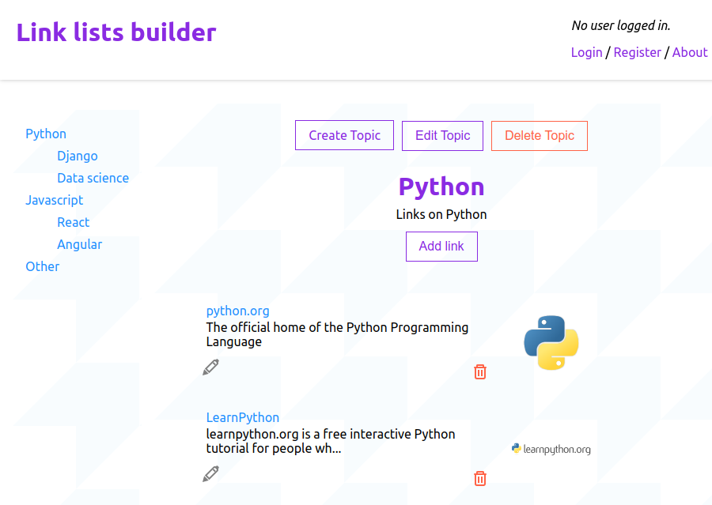

A full-stack simple web application using the MERN stack: MongoDB, Express, React, Node.js.

## Stack:

### Back-end
- MongoDB
- NodeJS
- Express.js
- passport.js (session based authentication)
- nodemailer (emailing password reset links)
- helmet

### Front-end
- React using hooks
- Axios
- React-router
- React-modal

[See the app on Heroku](https://afternoon-cliffs-39431.herokuapp.com). It can take up to 30 seconds to load the Heroku instance as it is a free plan.

